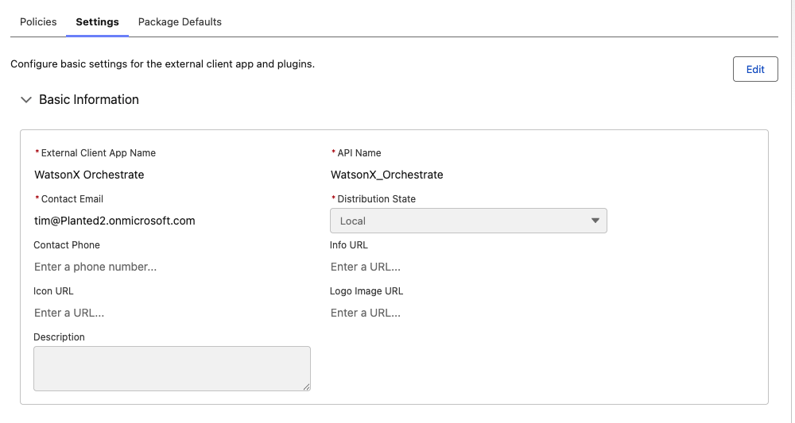
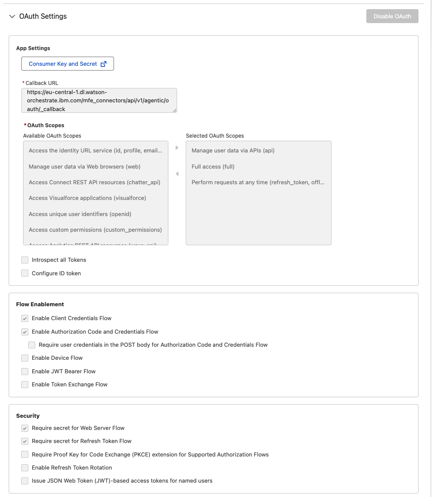
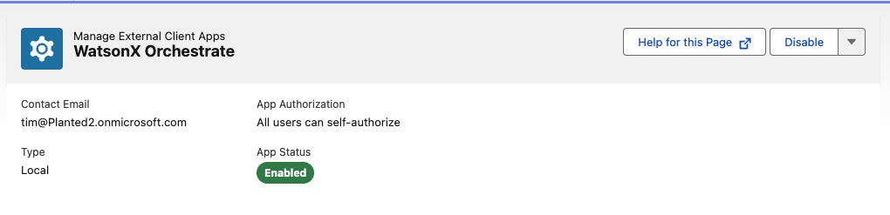
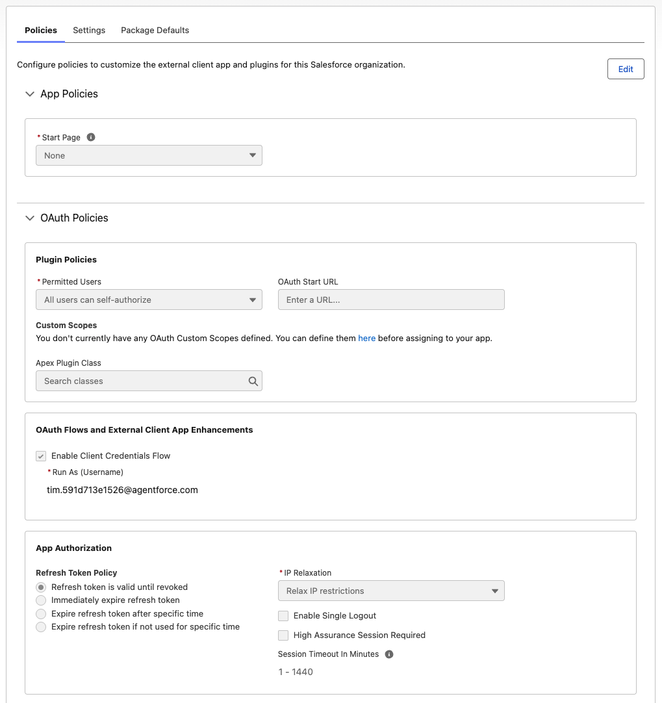
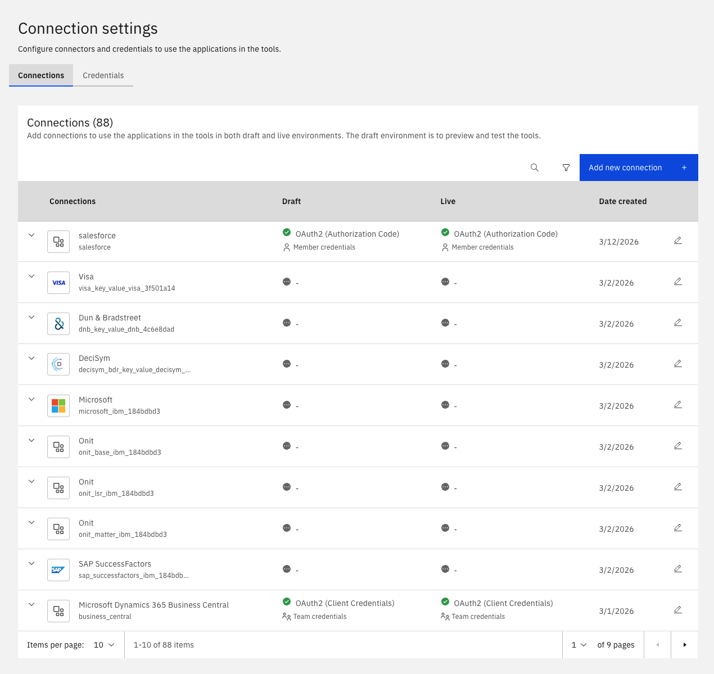
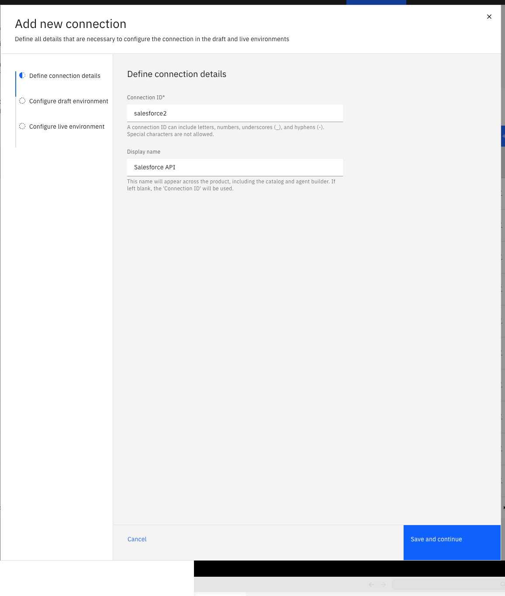
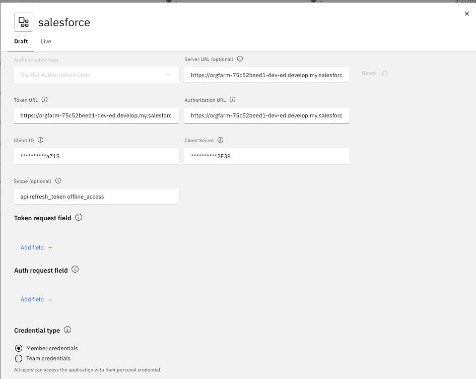

# Planted Sales Agent Documentation

## Table of Contents

1. [Agent Overview](#agent-overview)
   - [Planted Sales Agent (Master Orchestrator)](#planted-sales-agent-master-orchestrator)
   - [Business Central Agent](#business-central-agent)
   - [Salesforce Agent](#salesforce-agent)
2. [Importing Agents and Tools](#importing-agents-and-tools)
   - [Connecting to the ADK](#connecting-to-the-adk)
   - [Setting Up the Business Central Connection](#setting-up-the-business-central-connection)
   - [Setting Up the Salesforce Connection](#setting-up-the-salesforce-connection)
   - [Importing Tools](#importing-tools)
   - [Importing Agents](#importing-agents)
3. [MS Teams Integration](#ms-teams-integration)

---

## Agent Overview

The Planted sales assistant system is built as a **multi-agent architecture** — a orchestrator agent routes requests to two specialized sub-agents, each connected to a different backend system.

### Planted Sales Agent (Orchestrator)

The top-level agent that users interact with directly. It does not answer Business Central or Salesforce questions itself — instead, it delegates every request to the appropriate sub-agent based on what the user is asking. When a request spans both systems (e.g., a customer exists in Business Central *and* has open opportunities in Salesforce), it calls both sub-agents and merges the results into a single response.

---

### Business Central Agent

Connects to **Microsoft Dynamics 365 Business Central** and handles all sales order and inventory operations. Its core capabilities include:

- **Customer lookup** — Search customers by name or ID to resolve GUIDs before taking further action.
- **Inventory checks** — Retrieve available stock levels, item numbers, and units of measure.
- **Sales order creation** — Draft sales orders with up to 10 line items in a single request, with confirmation before submission.
- **Order history** — Pull all orders for a specific customer or within a given date range.
- **Order detail retrieval** — Fetch full order breakdowns including line items, unit prices, taxes, and totals.

---

### Salesforce Agent

Connects to **Salesforce CRM** and handles all pipeline, account, and opportunity operations. Its core capabilities include:

- **Account & contact lookup** — Search accounts by name to resolve Account IDs before creating or querying opportunities.
- **Opportunity management** — Find, create, and update opportunities filtered by date range, stage, or account.
- **Product & pricing lookup** — Retrieve active products and prices from the standard Salesforce price book.
- **Call logging** — Log completed calls against any opportunity with subject, notes, date, and duration.
- **Notes** — Add titled notes directly to any opportunity record.

---

## Importing Agents and Tools

> **Order matters.** Imports must follow this sequence or they will fail:
> 1. Connect to the ADK
> 2. Set up API connections (Business Central, Salesforce)
> 3. Import tools
> 4. Import sub-agents (Business Central Agent, Salesforce Agent)
> 5. Import the master orchestrator (Planted Sales Agent)
>
> Each layer depends on the one below it being in place first.

---

### Connecting to the ADK

Before importing any tools or agents, you need to install the watsonx Orchestrate ADK and connect it to your environment. Full ADK documentation is available at [developer.watson-orchestrate.ibm.com](https://developer.watson-orchestrate.ibm.com/getting_started/installing).

Install Python 3.11:

```bash
brew install python@3.11
```

Create and activate a virtual environment:

```bash
python3.11 -m venv .venv
source ./.venv/bin/activate
```

Install the watsonx Orchestrate ADK:

```bash
pip install ibm-watsonx-orchestrate
```

Add your environment and activate it — the service instance URL is the base URL of your watsonx Orchestrate instance:

```bash
orchestrate env add -n <environment-name> -u <service-instance-url>
orchestrate env activate <environment-name>
```

For Planted, the service instance URL is:
```
https://eu-central-1.dl.watson-orchestrate.ibm.com/...
```

Once activated, all subsequent `orchestrate` CLI commands will run against this environment.

---

### Setting Up the Business Central Connection

This connection uses **OAuth2 Authorization Code** with **Member credentials**, so each user logs in with their own Microsoft account. Their access is scoped to their own Business Central permissions — no per-user configuration is needed in watsonx Orchestrate.

Before importing any Business Central tools, you need to complete three things: register an app in Microsoft Azure, register it inside Business Central, and then create the connection in watsonx Orchestrate.

#### Part 1: Register an App in Microsoft Azure

This gives watsonx Orchestrate a secure OAuth identity to authenticate against Business Central.

1. Go to [portal.azure.com](https://portal.azure.com) and navigate to **App registrations**.
2. Open your existing app registration or create a new one. For Planted, this app is named **Business Central**.
3. From the **Overview** page, note down the following — you will need both when configuring the connection later:
   - **Application (client) ID** — e.g. `a3bc5adc-a621-4742-924c-ad5c2f9a250b`
   - **Directory (tenant) ID** — e.g. `4058ede8-b1f2-4dd6-8854-b95dda221d20`
4. Go to **Certificates & secrets → Client secrets** and copy the **Value** of your active secret. If none exists, click **New client secret** to generate one. Copy the value immediately — it is only shown once.
5. Go to **API permissions** and confirm the following permissions are granted. For per-user login (Authorization Code flow), you need **Delegated** permissions. If not present, add them and click **Grant admin consent for [your organisation]**:

   | API | Permission | Type |
   |---|---|---|
   | Dynamics 365 Business Central | `Financials.ReadWrite.All` | Delegated |
   | Dynamics 365 Business Central | `API.ReadWrite.All` | Application |
   | Dynamics 365 Business Central | `app_access` | Application |
   | Microsoft Graph | `User.Read` | Delegated |

6. Go to **Authentication (Preview)** and add the following as a **Web** redirect URI. Replace the domain prefix with your own watsonx Orchestrate instance region if different (e.g. `eu-central-1`, `us-east-1`):

   ```
   https://{your-wxo-domain}/mfe_connectors/api/v1/agentic/oauth/_callback
   ```

   For Planted, this is:
   ```
   https://eu-central-1.dl.watson-orchestrate.ibm.com/mfe_connectors/api/v1/agentic/oauth/_callback
   ```

---

#### Part 2: Register the App in Business Central

The Azure app registration also needs to be recognised inside Business Central itself before it can make API calls.

1. In Business Central, use the search bar to find **Microsoft Entra Applications** and open it.
2. Find the entry matching your Azure app's **Client ID** and open it. For Planted, this is the entry described as `wxO` with state **Enabled**.
3. On the **Microsoft Entra Application Card**, confirm the **State** is set to **Enabled**. If it is Disabled, you must set it to Disabled first before making any changes, then re-enable.
4. Under **User Permission Sets**, assign the permissions the integration will need. For Planted, the following sets are assigned under the company **Planted**:

   | Permission Set | Description |
   |---|---|
   | D365 BASIC | Dynamics 365 Basic access |
   | D365 CUSTOMER, V... | View customers |
   | D365 ITEM, VIEW | View items |
   | D365 SALES DOC, E... | Create sales documents |

> **Note:** Since this integration now uses per-user login (Authorization Code flow), the **Grant Consent** button on the Entra Application Card should be clicked to allow delegated access. Each user who logs in will also need appropriate Business Central licenses and permissions assigned to their Microsoft account.

---

#### Part 3: Create the Connection in watsonx Orchestrate

##### Option A: Via the watsonx Orchestrate UI

1. In the watsonx Orchestrate UI, go to **Manage → Connections** and click **Add new connection**.
2. On the **Define connection details** step, enter:
   - **Connection ID** — `business_central`
   - **Display name** — `Business Central`
3. Click **Save and continue**. On the **Configure draft environment** step, set the following:
   - **SSO** — leave **Off**
   - **Authentication type** — select `Oauth2 Authorization Code`
   - **Credential type** — select `Member credentials` (each user logs in with their own Microsoft account)

   Then fill in the OAuth fields:

   | Field | How to find it | Example (Planted) |
   |---|---|---|
   | **Server URL** | `https://api.businesscentral.dynamics.com/v2.0/{tenant-domain}/{environment}/api/v2.0` | `https://api.businesscentral.dynamics.com/v2.0/Planted2.onmicrosoft.com/Production/api/v2.0` |
   | **Token URL** | `https://login.microsoftonline.com/{Directory (tenant) ID}/oauth2/v2.0/token` | `https://login.microsoftonline.com/4058ede8-b1f2-4dd6-8854-b95dda221d20/oauth2/v2.0/token` |
   | **Authorization URL** | `https://login.microsoftonline.com/{Directory (tenant) ID}/oauth2/v2.0/authorize` | `https://login.microsoftonline.com/4058ede8-b1f2-4dd6-8854-b95dda221d20/oauth2/v2.0/authorize` |
   | **Client ID** | Application (client) ID from Azure app Overview | `a3bc5adc-a621-4742-924c-ad5c2f9a250b` |
   | **Client Secret** | The secret value from Certificates & secrets | *(your secret value)* |
   | **Scope** | `https://api.businesscentral.dynamics.com/.default` | `https://api.businesscentral.dynamics.com/.default` |

4. Click **Next** and configure the **Live** tab with the same settings.
5. Click **Add connection**.

##### Option B: Via the CLI

Import the connection YAML:

```bash
orchestrate connections import -f wxo_timothy/connections/business_central.yaml
```

Then set credentials for both environments:

```bash
orchestrate connections set-credentials -a business_central \
  --env draft \
  --client-id '<YOUR_CLIENT_ID>' \
  --client-secret '<YOUR_CLIENT_SECRET>' \
  --authorization-url 'https://login.microsoftonline.com/<YOUR_TENANT_ID>/oauth2/v2.0/authorize' \
  --token-url 'https://login.microsoftonline.com/<YOUR_TENANT_ID>/oauth2/v2.0/token' \
  --scope 'https://api.businesscentral.dynamics.com/.default'
```

```bash
orchestrate connections set-credentials -a business_central \
  --env live \
  --client-id '<YOUR_CLIENT_ID>' \
  --client-secret '<YOUR_CLIENT_SECRET>' \
  --authorization-url 'https://login.microsoftonline.com/<YOUR_TENANT_ID>/oauth2/v2.0/authorize' \
  --token-url 'https://login.microsoftonline.com/<YOUR_TENANT_ID>/oauth2/v2.0/token' \
  --scope 'https://api.businesscentral.dynamics.com/.default'
```

Once the connection shows as active in the Connections list, you are ready to import the Business Central tools.

---

### Setting Up the Salesforce Connection

This connection uses **OAuth2 Authorization Code** with **Member credentials**. Unlike Client Credentials (where a single service account is shared), this setup means each user logs in with their own Salesforce account when they first use a Salesforce tool. Their API access is scoped to their own Salesforce profile and permissions — no per-user configuration is needed in watsonx Orchestrate.

| | Client Credentials (shared) | Auth Code + Member (per-user) |
|---|---|---|
| Who authenticates? | A single shared service account | Each user logs in individually |
| User context | All API calls run as one "Run As" user | Each user sees their own data/permissions |
| First tool call | Works immediately (team creds pre-set) | Prompts user to log in via Salesforce |
| Best for | Backend automation, no user involved | Interactive agents where user identity matters |

#### Prerequisites

- Each user who will use the Salesforce tools must have a Salesforce account in the org
- Their Salesforce profile/permission set determines what data they can access via the API
- No separate API keys, connections, or credentials are needed per user — the Connected App is the "door", each user brings their own "key" (their Salesforce login)

---

#### Part 1: Create a Connected App in Salesforce

Salesforce uses Connected Apps to manage external OAuth access. This is done entirely within Salesforce Setup.

1. In Salesforce, go to **Setup** and search for **App Manager** in the left sidebar under **Apps**.

2. Click **New External Client App** in the top right.

3. On the **Settings** tab, fill in the **Basic Information**:
   - **External Client App Name** — e.g. `WatsonX Orchestrate`
   - **API Name** — auto-populated, e.g. `WatsonX_Orchestrate`
   - **Contact Email** — your admin email
   - **Distribution State** — `Local`

   

4. Scroll down to **OAuth Settings** and configure the following:

   - **Callback URL** — enter your watsonx Orchestrate OAuth callback URL. For Planted:
     ```
     https://eu-central-1.dl.watson-orchestrate.ibm.com/mfe_connectors/api/v1/agentic/oauth/_callback
     ```
   - **Selected OAuth Scopes** — add the following three scopes:
     - `Manage user data via APIs (api)`
     - `Full access (full)`
     - `Perform requests at any time (refresh_token, offline_access)`

5. Under **Flow Enablement**, check both:
   - [x] **Enable Client Credentials Flow**
   - [x] **Enable Authorization Code and Credentials Flow**

6. Under **Security**, configure as follows:
   - [x] Require secret for Web Server Flow
   - [x] Require secret for Refresh Token Flow
   - [ ] Require Proof Key for Code Exchange (PKCE) — **leave unchecked** (watsonx Orchestrate does not support PKCE)
   - [ ] Enable Refresh Token Rotation — leave unchecked
   - [ ] Issue JSON Web Token (JWT) — leave unchecked

   > **Important:** The Authorization Code flow is what enables per-user login. Without this checked, users will not be prompted to authenticate.

   The completed OAuth Settings, Flow Enablement, and Security sections should look like this:

   

7. Save the app. Once saved, click **Consumer Key and Secret** to retrieve your credentials — you will need both when configuring the watsonx Orchestrate connection.

---

#### Part 2: Configure OAuth Policies on the Connected App

After saving, navigate to **External Client App Manager** in the left sidebar, find your app, and open it.

Confirm the app is **Enabled** and **App Authorization** is set to `All users can self-authorize`:



Go to the **Policies** tab:

1. Under **OAuth Policies → Plugin Policies**:
   - Set **Permitted Users** to `All users can self-authorize`

2. Under **OAuth Flows and External Client App Enhancements**:
   - Check **Enable Client Credentials Flow**
   - Set **Run As (Username)** to a Salesforce user — this is only used for the Client Credentials flow fallback, not for per-user Auth Code login. For Planted: `tim.591d713e1526@agentforce.com`

3. Under **App Authorization**:
   - Set **Refresh Token Policy** to `Refresh token is valid until revoked`
   - Set **IP Relaxation** to `Relax IP restrictions`

The completed Policies tab should look like this:



> **Note on user permissions:** Each user's Salesforce profile and permission sets control what they can access through the API. If a user gets permission errors when using a tool, check their Salesforce profile — they need at minimum: access to Accounts, Opportunities, Products, and Activities.

---

#### Part 3: Create the Connection in watsonx Orchestrate

You can create the connection via the UI or CLI. Both methods are described below.

##### Option A: Via the watsonx Orchestrate UI

1. Go to **Manage → Connections** and click **Add new connection**.

   

2. Enter a **Connection ID** of `salesforce` and a **Display name** of `Salesforce API`.

   

3. Click **Save and continue**. On the **Configure draft environment** step, set:
   - **SSO** — leave **Off**
   - **Authentication type** — `Oauth2 Authorization Code`
   - **Credential type** — `Member credentials` (each user provides their own login)

   Then fill in the OAuth fields:

   | Field | Value |
   |---|---|
   | **Server URL** | `https://orgfarm-75c52beed1-dev-ed.develop.my.salesforce.com` |
   | **Token URL** | `https://orgfarm-75c52beed1-dev-ed.develop.my.salesforce.com/services/oauth2/token` |
   | **Authorization URL** | `https://orgfarm-75c52beed1-dev-ed.develop.my.salesforce.com/services/oauth2/authorize` |
   | **Client ID** | Consumer Key from the Connected App |
   | **Client Secret** | Consumer Secret from the Connected App |
   | **Scope** | `api refresh_token offline_access` |

   The completed draft configuration should look like this:

   

4. Click **Next** and configure the **Live** tab with the same settings.
5. Click **Add connection**.

##### Option B: Via the CLI

Import the connection YAML:

```bash
orchestrate connections import -f wxo_timothy/connections/salesforce.yaml
```

Then set credentials for both environments:

```bash
orchestrate connections set-credentials -a salesforce \
  --env draft \
  --client-id '<YOUR_CONSUMER_KEY>' \
  --client-secret '<YOUR_CONSUMER_SECRET>' \
  --authorization-url 'https://orgfarm-75c52beed1-dev-ed.develop.my.salesforce.com/services/oauth2/authorize' \
  --token-url 'https://orgfarm-75c52beed1-dev-ed.develop.my.salesforce.com/services/oauth2/token' \
  --scope 'api refresh_token offline_access'
```

```bash
orchestrate connections set-credentials -a salesforce \
  --env live \
  --client-id '<YOUR_CONSUMER_KEY>' \
  --client-secret '<YOUR_CONSUMER_SECRET>' \
  --authorization-url 'https://orgfarm-75c52beed1-dev-ed.develop.my.salesforce.com/services/oauth2/authorize' \
  --token-url 'https://orgfarm-75c52beed1-dev-ed.develop.my.salesforce.com/services/oauth2/token' \
  --scope 'api refresh_token offline_access'
```

---

#### How Per-User Authentication Works at Runtime

1. A user starts a chat session and triggers a Salesforce tool (e.g. "show my open opportunities")
2. Since the connection uses **member credentials**, watsonx Orchestrate prompts the user to authenticate
3. The user is redirected to the Salesforce login page where they enter their own username and password
4. After login, Salesforce redirects back to the watsonx Orchestrate callback URL with an authorization code
5. Orchestrate exchanges the code for an access token and refresh token, scoped to that user's permissions
6. The tool executes using that user's token — they only see data their Salesforce profile allows
7. The refresh token keeps the session alive until revoked, so the user does not need to log in again for subsequent tool calls

> **No per-user setup is needed in watsonx Orchestrate.** The Connected App + member credentials handle everything automatically. Each user just needs a Salesforce account with appropriate permissions.

---

#### Troubleshooting

| Issue | Cause | Fix |
|---|---|---|
| `redirect_uri_mismatch` error | Callback URL in Salesforce doesn't match WXO | Verify the Callback URL in the Connected App is exactly `https://eu-central-1.dl.watson-orchestrate.ibm.com/mfe_connectors/api/v1/agentic/oauth/_callback` |
| Tool times out on first call | Dev org is sleeping after inactivity | Log into the Salesforce org via browser first to wake it up, then retry |
| `unsupported_grant_type` | Authorization Code flow not enabled | Check **Flow Enablement** in Connected App — "Enable Authorization Code and Credentials Flow" must be checked |
| User not prompted to log in | Connection type is `team` not `member` | Verify the connection is configured with `type: member` in the YAML or "Member credentials" in the UI |
| `invalid_client` error | Wrong Client ID or Secret | Re-check Consumer Key and Secret from the Connected App |
| User gets permission errors | Salesforce profile lacks access | Check the user's profile and permission sets — they need access to Accounts, Opportunities, Products, and Activities |

Once the connection shows as active, you are ready to import the Salesforce tools.

---

### Importing Tools

With both connections in place, import the tools for each sub-agent. Tools must exist in the environment before the agents that use them can be imported.

Because the Business Central and Salesforce tools use OAuth2 connections to authenticate against their respective APIs, you must bind the correct connection to each tool at import time using the `-a` flag. Without this, the tool will import but will fail at runtime when it tries to fetch credentials.

Import the Business Central tools first, passing the Business Central connection ID:

```bash
orchestrate tools import -k python -f <path-to-bc-tool-file> -a business_central_planted
```

Then import the Salesforce tools, passing the Salesforce connection ID:

```bash
orchestrate tools import -k python -f <path-to-sf-tool-file> -a salesforce
```

If the connection ID used inside the tool's code differs from the one registered in your Orchestrate environment, you can remap it:

```bash
orchestrate tools import -k python -f <path-to-tool-file> -a app_id_in_tool=app_id_in_orchestrate
```

To verify all tools have been registered successfully:

```bash
orchestrate tools list
```

Confirm that all expected tools appear in the list before proceeding to agent import.

> **Note:** The connection IDs passed with `-a` must exactly match the Connection IDs you set when creating the connections in watsonx Orchestrate — in this case `business_central` for Business Central tools and `salesforce` for Salesforce tools. If they don't match, the import will fail.

> **Note:** Before importing the other Business Central tools, import `get_company_id.py` first and run it to retrieve your company's ID. Each of the other tools has the company ID hardcoded (e.g. `company_id = "572323a2-e013-f111-8405-7ced8d42f5ae"`) — this value is specific to your Business Central instance and must be updated in each tool file before importing them. If you import the tools with the wrong company ID, all API requests will fail. Alternatively, the tools can be refactored to call `get_company_id` dynamically at runtime rather than using a hardcoded value, which would remove the need to update each file manually.
---

### Importing Agents

Once all tools are imported, import the agents in the following order:

**Step 1 — Import the Business Central Agent:**

```bash
orchestrate agents import -f business_central_agent.yaml
```

**Step 2 — Import the Salesforce Agent:**

```bash
orchestrate agents import -f salesforce_agent.yaml
```

**Step 3 — Import the Planted Sales Agent (orchestrator):**

```bash
orchestrate agents import -f planted_sales_agent.yaml
```

To confirm all three agents were imported successfully:

```bash
orchestrate agents list -v
```

## MS Teams Integration

For instructions on setting up the Planted Sales Agent in Microsoft Teams, including channel configuration and bot permissions, see the setup guide:

[MS Teams Channel Setup Guide](documents/channel_setup_teams.pdf)

