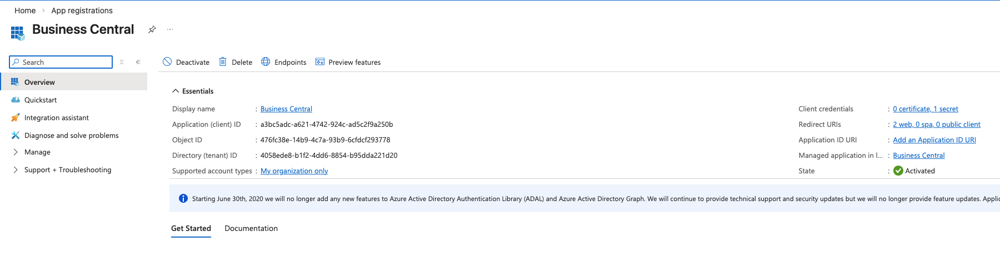
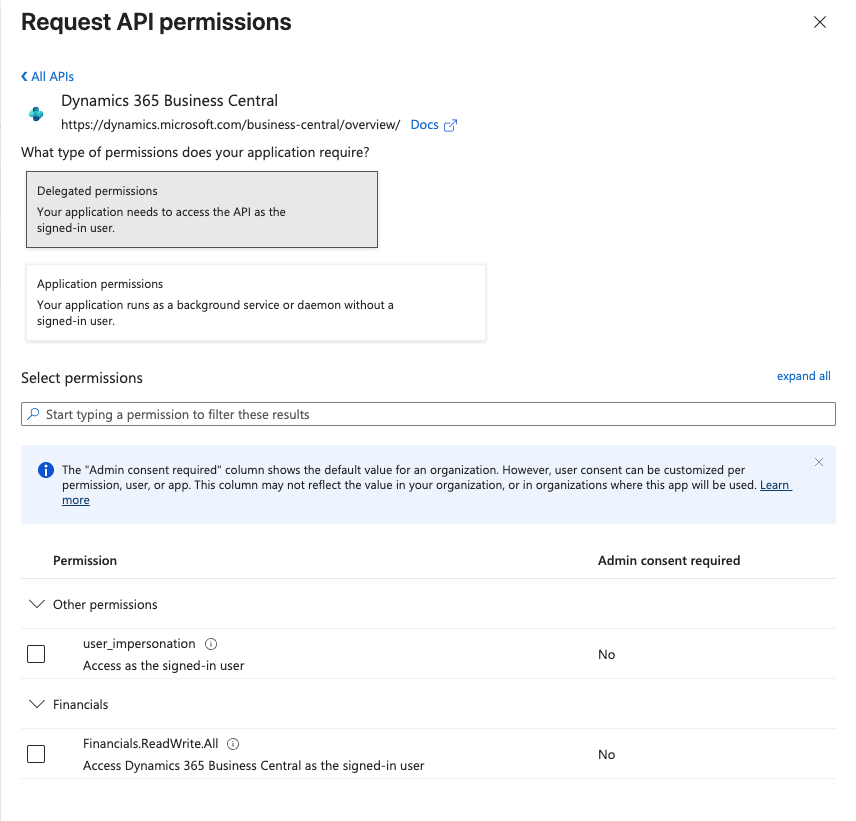
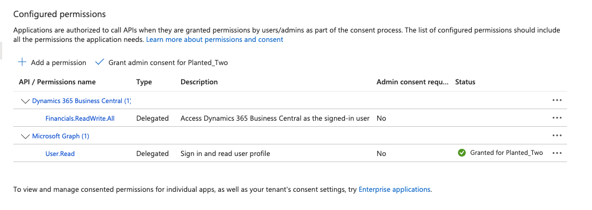
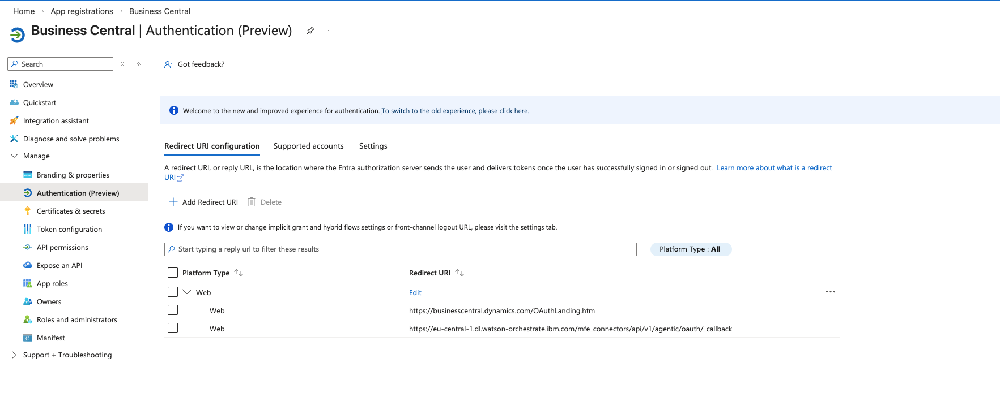
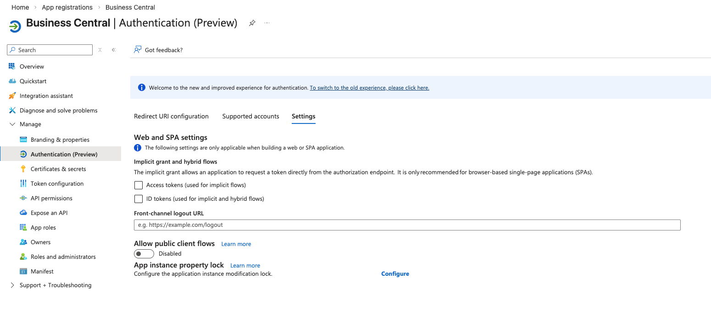
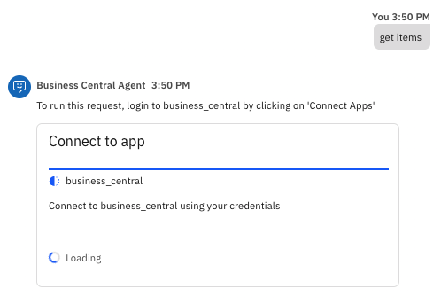
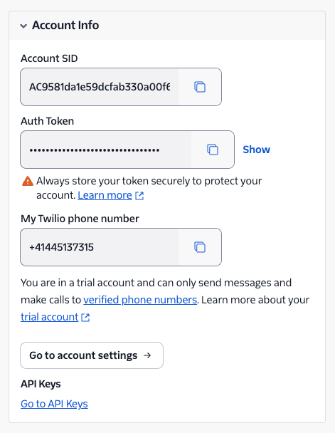
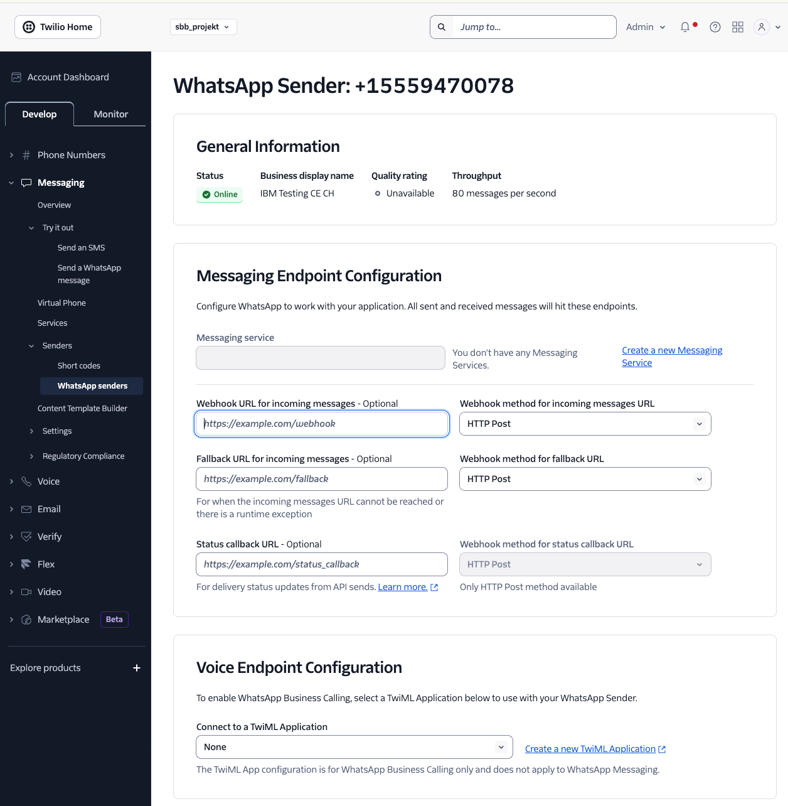

# Planted Sales Agent Documentation

## Table of Contents

1. [Agent Overview](#agent-overview)
   - [Planted Sales Agent (Master Orchestrator)](#planted-sales-agent-master-orchestrator)
   - [Business Central Agent](#business-central-agent)
   - [Salesforce Agent](#salesforce-agent)
2. [Importing Agents and Tools](#importing-agents-and-tools)
   - [Connecting to the ADK](#connecting-to-the-adk)
   - [Setting Up the Business Central Connection](#setting-up-the-business-central-connection)
   - [Setting Up the Salesforce Connection](#setting-up-the-salesforce-connection)
   - [Importing Tools](#importing-tools)
   - [Importing Agents](#importing-agents)
3. [Channel Integrations](#channel-integrations)
   - [MS Teams Integration](#ms-teams-integration)
   - [WhatsApp Integration (via Twilio)](#whatsapp-integration-via-twilio)
4. [Shop Agent](#shop-agent)
   - [Architecture Overview](#architecture-overview-1)
   - [Tools](#shop-tools)
   - [Importing the Shop Tools and Agent](#importing-the-shop-tools-and-agent)
   - [Agent Capabilities](#agent-capabilities-1)

---

## Agent Overview

The Planted sales assistant system is built as a **multi-agent architecture** — a orchestrator agent routes requests to two specialized sub-agents, each connected to a different backend system.

### Planted Sales Agent (Orchestrator)

The top-level agent that users interact with directly. It does not answer Business Central or Salesforce questions itself — instead, it delegates every request to the appropriate sub-agent based on what the user is asking. When a request spans both systems (e.g., a customer exists in Business Central *and* has open opportunities in Salesforce), it calls both sub-agents and merges the results into a single response.

---

### Business Central Agent

Connects to **Microsoft Dynamics 365 Business Central** and handles all sales order and inventory operations. Its core capabilities include:

- **Customer lookup** — Search customers by name or ID to resolve GUIDs before taking further action.
- **Inventory checks** — Retrieve available stock levels, item numbers, and units of measure.
- **Sales order creation** — Draft sales orders with up to 10 line items in a single request, with confirmation before submission.
- **Order history** — Pull all orders for a specific customer or within a given date range.
- **Order detail retrieval** — Fetch full order breakdowns including line items, unit prices, taxes, and totals.

---

### Salesforce Agent

Connects to **Salesforce CRM** and handles all pipeline, account, and opportunity operations. Its core capabilities include:

- **Account & contact lookup** — Search accounts by name to resolve Account IDs before creating or querying opportunities.
- **Opportunity management** — Find, create, and update opportunities filtered by date range, stage, or account.
- **Product & pricing lookup** — Retrieve active products and prices from the standard Salesforce price book.
- **Call logging** — Log completed calls against any opportunity with subject, notes, date, and duration.
- **Notes** — Add titled notes directly to any opportunity record.

---

## Importing Agents and Tools

> **Order matters.** Imports must follow this sequence or they will fail:
> 1. Connect to the ADK
> 2. Set up API connections (Business Central, Salesforce)
> 3. Import tools
> 4. Import sub-agents (Business Central Agent, Salesforce Agent)
> 5. Import the master orchestrator (Planted Sales Agent)
>
> Each layer depends on the one below it being in place first.

---

### Connecting to the ADK

Before importing any tools or agents, you need to install the watsonx Orchestrate ADK and connect it to your environment. Full ADK documentation is available at [developer.watson-orchestrate.ibm.com](https://developer.watson-orchestrate.ibm.com/getting_started/installing).

Install Python 3.11:

```bash
brew install python@3.11
```

Create and activate a virtual environment:

```bash
python3.11 -m venv .venv
source ./.venv/bin/activate
```

Install the watsonx Orchestrate ADK:

```bash
pip install ibm-watsonx-orchestrate
```

Add your environment and activate it — the service instance URL is the base URL of your watsonx Orchestrate instance:

```bash
orchestrate env add -n <environment-name> -u <service-instance-url>
orchestrate env activate <environment-name>
```

For Planted, the service instance URL is:
```
https://eu-central-1.dl.watson-orchestrate.ibm.com/...
```

Once activated, all subsequent `orchestrate` CLI commands will run against this environment.

---

### Setting Up the Business Central Connection

This connection uses **OAuth2 Authorization Code** with **Member credentials**, so each user logs in with their own Microsoft account. Their access in Business Central is scoped to their own user permissions — no per-user configuration is needed in watsonx Orchestrate.

| | Client Credentials (shared) | Auth Code + Member (per-user) |
|---|---|---|
| Who authenticates? | A single shared service account | Each user logs in individually |
| User context | All API calls run as one app identity | Each user's own BC permissions apply |
| First tool call | Works immediately (team creds pre-set) | Prompts user to log in via Microsoft |
| Best for | Backend automation, no user involved | Interactive agents where user identity matters |

#### Prerequisites

- Each user who will use the Business Central tools must have a Microsoft account in your Azure AD tenant with a Business Central license
- Their Business Central user permissions determine what data they can access via the API
- No separate API keys, connections, or credentials are needed per user — the Azure app registration is the "door", each user brings their own "key" (their Microsoft login)

---

#### Part 1: Register an App in Microsoft Entra ID (Azure AD)

This gives watsonx Orchestrate a secure OAuth identity to authenticate against Business Central on behalf of each user.

1. Go to [portal.azure.com](https://portal.azure.com) and navigate to **App registrations**.

2. Open your existing app registration or click **New registration** to create one. For Planted, this app is named **Business Central**.

3. From the **Overview** page, note down the following — you will need both when configuring the watsonx Orchestrate connection:
   - **Application (client) ID** — e.g. `a3bc5adc-a621-4742-924c-ad5c2f9a250b`
   - **Directory (tenant) ID** — e.g. `4058ede8-b1f2-4dd6-8854-b95dda221d20`

   

4. Go to **Certificates & secrets → Client secrets** and copy the **Value** of your active secret. If none exists, click **New client secret**, give it a description and expiry, then copy the value immediately — it is only shown once.

---

#### Part 2: Configure API Permissions (Delegated Only)

For per-user login (Authorization Code flow), you only need **Delegated** permissions. Application permissions are not required and should be removed if present.

1. Go to **API permissions** and click **Add a permission**.

2. Select **Dynamics 365 Business Central** from the API list.

3. Choose **Delegated permissions** (not Application permissions):

   

4. Select **Financials.ReadWrite.All** — this grants "Access Dynamics 365 Business Central as the signed-in user". Admin consent is not required for this permission.

5. The final permissions should look like this — only Delegated permissions, no Application permissions:

   | API | Permission | Type | Admin Consent Required |
   |---|---|---|---|
   | Dynamics 365 Business Central | `Financials.ReadWrite.All` | Delegated | No |
   | Microsoft Graph | `User.Read` | Delegated | No |

   

> **Note:** If you previously had Application permissions (`API.ReadWrite.All`, `app_access`) from a Client Credentials setup, remove them. They are not needed for the Authorization Code flow and keeping them adds unnecessary privilege.

---

#### Part 3: Configure Authentication (Redirect URIs)

1. Go to **Authentication (Preview)** in the left sidebar.

2. Under **Redirect URI configuration**, add the watsonx Orchestrate OAuth callback URL as a **Web** platform redirect URI. If there is no Web platform yet, click **Add a platform → Web**.

   Add this URI (replace the region prefix if your WXO instance is in a different region):
   ```
   https://eu-central-1.dl.watson-orchestrate.ibm.com/mfe_connectors/api/v1/agentic/oauth/_callback
   ```

   You may also keep the default Business Central redirect URI if it was already present:

   

3. Click the **Settings** tab on the same page and confirm:
   - **Implicit grant and hybrid flows** — both checkboxes unchecked (Access tokens, ID tokens)
   - **Allow public client flows** — **Disabled**

   

4. Click **Save**.

---

#### Part 4: Create the Connection in watsonx Orchestrate

##### Option A: Via the watsonx Orchestrate UI

1. In the watsonx Orchestrate UI, go to **Manage → Connections** and click **Add new connection**.
2. On the **Define connection details** step, enter:
   - **Connection ID** — `business_central`
   - **Display name** — `Business Central`
3. Click **Save and continue**. On the **Configure draft environment** step, set:
   - **SSO** — leave **Off**
   - **Authentication type** — `Oauth2 Authorization Code`
   - **Credential type** — `Member credentials` (each user logs in with their own Microsoft account)

   Then fill in the OAuth fields:

   | Field | How to find it | Example (Planted) |
   |---|---|---|
   | **Server URL** | `https://api.businesscentral.dynamics.com/v2.0/{tenant-domain}/{environment}/api/v2.0` | `https://api.businesscentral.dynamics.com/v2.0/Planted2.onmicrosoft.com/Production/api/v2.0` |
   | **Token URL** | `https://login.microsoftonline.com/{tenant-id}/oauth2/v2.0/token` | `https://login.microsoftonline.com/4058ede8-b1f2-4dd6-8854-b95dda221d20/oauth2/v2.0/token` |
   | **Authorization URL** | `https://login.microsoftonline.com/{tenant-id}/oauth2/v2.0/authorize` | `https://login.microsoftonline.com/4058ede8-b1f2-4dd6-8854-b95dda221d20/oauth2/v2.0/authorize` |
   | **Client ID** | Application (client) ID from Azure app Overview | `a3bc5adc-a621-4742-924c-ad5c2f9a250b` |
   | **Client Secret** | The secret value from Certificates & secrets | *(your secret value)* |
   | **Scope** | Always use `.default` for Microsoft APIs | `https://api.businesscentral.dynamics.com/.default offline_access` |

4. Click **Next** and configure the **Live** tab with the same settings.
5. Click **Add connection**.

##### Option B: Via the CLI

Import the connection YAML:

```bash
orchestrate connections import -f wxo_timothy/connections/business_central.yaml
```

Then set credentials for both environments:

```bash
orchestrate connections set-credentials -a business_central \
  --env draft \
  --client-id '<YOUR_CLIENT_ID>' \
  --client-secret '<YOUR_CLIENT_SECRET>' \
  --authorization-url 'https://login.microsoftonline.com/<YOUR_TENANT_ID>/oauth2/v2.0/authorize' \
  --token-url 'https://login.microsoftonline.com/<YOUR_TENANT_ID>/oauth2/v2.0/token' \
  --scope 'https://api.businesscentral.dynamics.com/.default offline_access'
```

```bash
orchestrate connections set-credentials -a business_central \
  --env live \
  --client-id '<YOUR_CLIENT_ID>' \
  --client-secret '<YOUR_CLIENT_SECRET>' \
  --authorization-url 'https://login.microsoftonline.com/<YOUR_TENANT_ID>/oauth2/v2.0/authorize' \
  --token-url 'https://login.microsoftonline.com/<YOUR_TENANT_ID>/oauth2/v2.0/token' \
  --scope 'https://api.businesscentral.dynamics.com/.default offline_access'
```

Once the connection shows as active in the Connections list, you are ready to import the Business Central tools.

---

#### How Per-User Authentication Works at Runtime

1. A user starts a chat session and triggers a Business Central tool (e.g. "get items")
2. Since the connection uses **member credentials**, watsonx Orchestrate prompts the user to authenticate via "Connect Apps"

   

3. The user clicks "Connect Apps" and is redirected to the Microsoft login page where they sign in with their own Microsoft account
4. On first login, a consent screen appears asking the user to grant the app access to Business Central — if an admin already granted org-wide consent, this is skipped
5. After login, Microsoft redirects back to watsonx Orchestrate with an authorization code
6. Orchestrate exchanges the code for an access token scoped to that user's Business Central permissions
7. The tool executes using that user's token — they only see data their BC user permissions allow
8. The refresh token keeps the session alive, so the user does not need to log in again for subsequent tool calls

> **No per-user setup is needed in watsonx Orchestrate.** The Azure app registration + member credentials handle everything automatically. Each user just needs a Microsoft account with a Business Central license and appropriate permissions.

---

#### Troubleshooting

| Issue | Cause | Fix |
|---|---|---|
| `AADSTS90092` error after consent | Scope mismatch or missing redirect URI | Verify scope is `https://api.businesscentral.dynamics.com/.default offline_access` and the WXO callback redirect URI is added under **Authentication → Web** |
| `redirect_uri_mismatch` error | Redirect URI in Azure doesn't match WXO | Verify the redirect URI under Authentication is exactly `https://eu-central-1.dl.watson-orchestrate.ibm.com/mfe_connectors/api/v1/agentic/oauth/_callback` |
| User not prompted to log in | Connection type is `team` not `member` | Verify the connection is configured with `type: member` in the YAML or "Member credentials" in the UI |
| `invalid_client` error | Wrong Client ID or Secret | Re-check Application (client) ID from Overview and the secret value from Certificates & secrets |
| `AADSTS700016` — app not found | Client ID is wrong or app is in a different tenant | Verify the Client ID matches the Overview page and the tenant ID in the URLs matches the Directory (tenant) ID |
| User gets permission errors in BC | BC user lacks permissions | Check the user's Business Central user permissions — they need access to the relevant entities (customers, items, sales orders) |
| Consent screen keeps reappearing | Admin consent not granted | An admin should check "Consent on behalf of your organization" during login, or go to Azure → Enterprise applications → your app → Permissions → Grant admin consent |

---

### Setting Up the Salesforce Connection

This connection uses **OAuth2 Authorization Code** with **Member credentials**. Unlike Client Credentials (where a single service account is shared), this setup means each user logs in with their own Salesforce account when they first use a Salesforce tool. Their API access is scoped to their own Salesforce profile and permissions — no per-user configuration is needed in watsonx Orchestrate.

| | Client Credentials (shared) | Auth Code + Member (per-user) |
|---|---|---|
| Who authenticates? | A single shared service account | Each user logs in individually |
| User context | All API calls run as one "Run As" user | Each user sees their own data/permissions |
| First tool call | Works immediately (team creds pre-set) | Prompts user to log in via Salesforce |
| Best for | Backend automation, no user involved | Interactive agents where user identity matters |

#### Prerequisites

- Each user who will use the Salesforce tools must have a Salesforce account in the org
- Their Salesforce profile/permission set determines what data they can access via the API
- No separate API keys, connections, or credentials are needed per user — the Connected App is the "door", each user brings their own "key" (their Salesforce login)

---

#### Part 1: Create a Connected App in Salesforce

Salesforce uses Connected Apps to manage external OAuth access. This is done entirely within Salesforce Setup.

1. In Salesforce, go to **Setup** and search for **App Manager** in the left sidebar under **Apps**.

2. Click **New External Client App** in the top right.

3. On the **Settings** tab, fill in the **Basic Information**:
   - **External Client App Name** — e.g. `WatsonX Orchestrate`
   - **API Name** — auto-populated, e.g. `WatsonX_Orchestrate`
   - **Contact Email** — your admin email
   - **Distribution State** — `Local`

   

4. Scroll down to **OAuth Settings** and configure the following:

   - **Callback URL** — enter your watsonx Orchestrate OAuth callback URL. For Planted:
     ```
     https://eu-central-1.dl.watson-orchestrate.ibm.com/mfe_connectors/api/v1/agentic/oauth/_callback
     ```
   - **Selected OAuth Scopes** — add the following three scopes:
     - `Manage user data via APIs (api)`
     - `Full access (full)`
     - `Perform requests at any time (refresh_token, offline_access)`

5. Under **Flow Enablement**, check both:
   - [x] **Enable Client Credentials Flow**
   - [x] **Enable Authorization Code and Credentials Flow**

6. Under **Security**, configure as follows:
   - [x] Require secret for Web Server Flow
   - [x] Require secret for Refresh Token Flow
   - [ ] Require Proof Key for Code Exchange (PKCE) — **leave unchecked** (watsonx Orchestrate does not support PKCE)
   - [ ] Enable Refresh Token Rotation — leave unchecked
   - [ ] Issue JSON Web Token (JWT) — leave unchecked

   > **Important:** The Authorization Code flow is what enables per-user login. Without this checked, users will not be prompted to authenticate.

   The completed OAuth Settings, Flow Enablement, and Security sections should look like this:

   

7. Save the app. Once saved, click **Consumer Key and Secret** to retrieve your credentials — you will need both when configuring the watsonx Orchestrate connection.

---

#### Part 2: Configure OAuth Policies on the Connected App

After saving, navigate to **External Client App Manager** in the left sidebar, find your app, and open it.

Confirm the app is **Enabled** and **App Authorization** is set to `All users can self-authorize`:


Go to the **Policies** tab:

1. Under **OAuth Policies → Plugin Policies**:
   - Set **Permitted Users** to `All users can self-authorize`

2. Under **OAuth Flows and External Client App Enhancements**:
   - Check **Enable Client Credentials Flow**
   - Set **Run As (Username)** to a Salesforce user — this is only used for the Client Credentials flow fallback, not for per-user Auth Code login. For Planted: `tim.591d713e1526@agentforce.com`

3. Under **App Authorization**:
   - Set **Refresh Token Policy** to `Refresh token is valid until revoked`
   - Set **IP Relaxation** to `Relax IP restrictions`

The completed Policies tab should look like this:


> **Note on user permissions:** Each user's Salesforce profile and permission sets control what they can access through the API. If a user gets permission errors when using a tool, check their Salesforce profile — they need at minimum: access to Accounts, Opportunities, Products, and Activities.

---

#### Part 3: Create the Connection in watsonx Orchestrate

You can create the connection via the UI or CLI. Both methods are described below.

##### Option A: Via the watsonx Orchestrate UI

1. Go to **Manage → Connections** and click **Add new connection**.

   

2. Enter a **Connection ID** of `salesforce` and a **Display name** of `Salesforce API`.

   

3. Click **Save and continue**. On the **Configure draft environment** step, set:
   - **SSO** — leave **Off**
   - **Authentication type** — `Oauth2 Authorization Code`
   - **Credential type** — `Member credentials` (each user provides their own login)

   Then fill in the OAuth fields:

   | Field | Value |
   |---|---|
   | **Server URL** | `https://orgfarm-75c52beed1-dev-ed.develop.my.salesforce.com` |
   | **Token URL** | `https://orgfarm-75c52beed1-dev-ed.develop.my.salesforce.com/services/oauth2/token` |
   | **Authorization URL** | `https://orgfarm-75c52beed1-dev-ed.develop.my.salesforce.com/services/oauth2/authorize` |
   | **Client ID** | Consumer Key from the Connected App |
   | **Client Secret** | Consumer Secret from the Connected App |
   | **Scope** | `api refresh_token offline_access` |

   The completed draft configuration should look like this:

   

4. Click **Next** and configure the **Live** tab with the same settings.
5. Click **Add connection**.

##### Option B: Via the CLI

Import the connection YAML:

```bash
orchestrate connections import -f wxo_timothy/connections/salesforce.yaml
```

Then set credentials for both environments:

```bash
orchestrate connections set-credentials -a salesforce \
  --env draft \
  --client-id '<YOUR_CONSUMER_KEY>' \
  --client-secret '<YOUR_CONSUMER_SECRET>' \
  --authorization-url 'https://orgfarm-75c52beed1-dev-ed.develop.my.salesforce.com/services/oauth2/authorize' \
  --token-url 'https://orgfarm-75c52beed1-dev-ed.develop.my.salesforce.com/services/oauth2/token' \
  --scope 'api refresh_token offline_access'
```

```bash
orchestrate connections set-credentials -a salesforce \
  --env live \
  --client-id '<YOUR_CONSUMER_KEY>' \
  --client-secret '<YOUR_CONSUMER_SECRET>' \
  --authorization-url 'https://orgfarm-75c52beed1-dev-ed.develop.my.salesforce.com/services/oauth2/authorize' \
  --token-url 'https://orgfarm-75c52beed1-dev-ed.develop.my.salesforce.com/services/oauth2/token' \
  --scope 'api refresh_token offline_access'
```

---

#### How Per-User Authentication Works at Runtime

1. A user starts a chat session and triggers a Salesforce tool (e.g. "show my open opportunities")
2. Since the connection uses **member credentials**, watsonx Orchestrate prompts the user to authenticate
3. The user is redirected to the Salesforce login page where they enter their own username and password
4. After login, Salesforce redirects back to the watsonx Orchestrate callback URL with an authorization code
5. Orchestrate exchanges the code for an access token and refresh token, scoped to that user's permissions
6. The tool executes using that user's token — they only see data their Salesforce profile allows
7. The refresh token keeps the session alive until revoked, so the user does not need to log in again for subsequent tool calls

> **No per-user setup is needed in watsonx Orchestrate.** The Connected App + member credentials handle everything automatically. Each user just needs a Salesforce account with appropriate permissions.

---

#### Troubleshooting

| Issue | Cause | Fix |
|---|---|---|
| `redirect_uri_mismatch` error | Callback URL in Salesforce doesn't match WXO | Verify the Callback URL in the Connected App is exactly `https://eu-central-1.dl.watson-orchestrate.ibm.com/mfe_connectors/api/v1/agentic/oauth/_callback` |
| Tool times out on first call | Dev org is sleeping after inactivity | Log into the Salesforce org via browser first to wake it up, then retry |
| Persistent `401 Unauthorized` errors | Developer Edition orgs (`orgfarm-*`) go to sleep after inactivity, which invalidates access tokens and breaks refresh token exchange — even when all Connected App settings are correct | **Do not use a Salesforce Developer Edition org for production agents.** Switch the connection to a production org (e.g. `https://plantedfoods.my.salesforce.com`) — production orgs do not sleep and token refresh works reliably. Update the Server URL, Token URL, and Authorization URL accordingly, and use the Consumer Key/Secret from a Connected App on the production org |
| `unsupported_grant_type` | Authorization Code flow not enabled | Check **Flow Enablement** in Connected App — "Enable Authorization Code and Credentials Flow" must be checked |
| User not prompted to log in | Connection type is `team` not `member` | Verify the connection is configured with `type: member` in the YAML or "Member credentials" in the UI |
| `invalid_client` error | Wrong Client ID or Secret | Re-check Consumer Key and Secret from the Connected App |
| User gets permission errors | Salesforce profile lacks access | Check the user's profile and permission sets — they need access to Accounts, Opportunities, Products, and Activities |

Once the connection shows as active, you are ready to import the Salesforce tools.

---

### Importing Tools

With both connections in place, import the tools for each sub-agent. Tools must exist in the environment before the agents that use them can be imported.

Because the Business Central and Salesforce tools use OAuth2 connections to authenticate against their respective APIs, you must bind the correct connection to each tool at import time using the `-a` flag. Without this, the tool will import but will fail at runtime when it tries to fetch credentials.

Import the Business Central tools first, passing the Business Central connection ID:

```bash
orchestrate tools import -k python -f <path-to-bc-tool-file> -a business_central
```

Then import the Salesforce tools, passing the Salesforce connection ID:

```bash
orchestrate tools import -k python -f <path-to-sf-tool-file> -a salesforce
```

If the connection ID used inside the tool's code differs from the one registered in your Orchestrate environment, you can remap it:

```bash
orchestrate tools import -k python -f <path-to-tool-file> -a app_id_in_tool=app_id_in_orchestrate
```

To verify all tools have been registered successfully:

```bash
orchestrate tools list
```

Confirm that all expected tools appear in the list before proceeding to agent import.

> **Note:** The connection IDs passed with `-a` must exactly match the Connection IDs you set when creating the connections in watsonx Orchestrate — in this case `business_central` for Business Central tools and `salesforce` for Salesforce tools. If they don't match, the import will fail.

> **Note:** Before importing the other Business Central tools, import `get_company_id.py` first and run it to retrieve your company's ID. Each of the other tools has the company ID hardcoded (e.g. `company_id = "572323a2-e013-f111-8405-7ced8d42f5ae"`) — this value is specific to your Business Central instance and must be updated in each tool file before importing them. If you import the tools with the wrong company ID, all API requests will fail. Alternatively, the tools can be refactored to call `get_company_id` dynamically at runtime rather than using a hardcoded value, which would remove the need to update each file manually.
---

### Importing Agents

Once all tools are imported, import the agents in the following order:

**Step 1 — Import the Business Central Agent:**

```bash
orchestrate agents import -f business_central_agent.yaml
```

**Step 2 — Import the Salesforce Agent:**

```bash
orchestrate agents import -f salesforce_agent.yaml
```

**Step 3 — Import the Planted Sales Agent (orchestrator):**

```bash
orchestrate agents import -f planted_sales_agent.yaml
```

To confirm all three agents were imported successfully:

```bash
orchestrate agents list -v
```

## Channel Integrations

watsonx Orchestrate supports multiple messaging channels — each channel connects your agent to an external platform so users can interact with it outside of the WXO web UI. Full ADK channel documentation is available at [developer.watson-orchestrate.ibm.com/channels/establishing_channels](https://developer.watson-orchestrate.ibm.com/channels/establishing_channels).

The setup on the external platform side (Facebook, Twilio, Microsoft Teams, etc.) follows each platform's standard onboarding flow. The watsonx Orchestrate side is the same for all channels: create a channel config, import it via the CLI, and paste the resulting Event URL into the platform's webhook settings.

> **Critical limitation:** OAuth connections (all types — Auth Code, Client Credentials, Implicit, Password) are **only supported in the watsonx Orchestrate integrated webchat UI**. They do not work on external channels such as MS Teams, WhatsApp, or embedded webchat. If an agent on an external channel tries to call a tool that uses an OAuth connection, the tool will fail silently and the LLM will fabricate data instead of returning real results. To use authenticated tools on external channels, use **Key-Value connections** and handle the token exchange manually in your Python tool code.

---

### MS Teams Integration

For instructions on setting up the Planted Sales Agent in Microsoft Teams, including channel configuration and bot permissions, see the setup guide:

[MS Teams Channel Setup Guide](documents/channel_setup_teams.pdf)

---

### WhatsApp Integration (via Twilio)

This section covers connecting the Planted Sales Agent to WhatsApp using Twilio as the messaging provider.

#### Prerequisites

- A **Twilio account** (trial works for testing, but has a 250 business-initiated message limit)
- **Administrator access** to a Meta Business Portfolio (or the ability to create one during setup)
- A phone number to register as a WhatsApp sender — either a Twilio number or your own

Your Twilio **Account SID** and **Auth Token** are on the Twilio Console dashboard under Account Info:



---

#### Part 1: Register a WhatsApp Sender in Twilio

Before Twilio can send or receive WhatsApp messages, you need to register a phone number as a WhatsApp sender. This links the number to a WhatsApp Business Account (WABA) through Meta.

1. In the Twilio Console, go to **Messaging → Senders → WhatsApp Senders**.
2. Click **Create new sender**.
3. **Select a phone number** — choose a Twilio number or enter your own.
4. Click **Continue with Facebook** — this opens a popup where you will:
   - Log in to Facebook
   - Create or select a Meta Business Portfolio
   - Create or select a WhatsApp Business Account (WABA)
   - Set a display name and category for your WhatsApp Business profile
   - Verify ownership of the phone number

> **Important — phone number verification:** Meta sends a verification code to the phone number you are registering. How you receive it depends on the number type:
>
> | Phone number type | Capabilities | How the code is delivered |
> |---|---|---|
> | Twilio number | SMS | Code appears automatically in the Twilio Console (step 3 of the sender setup) |
> | Twilio number | Voice only | Set up a voicemail webhook (see below), then request verification via phone call — code is emailed to you |
> | Non-Twilio number | SMS | Code arrives via SMS on the phone |
> | Non-Twilio number | Voice | Code is read out via voice call |
>
> **If your Twilio number is voice-only** (no SMS capability — you can check this on the phone number's Configure page, which will show "Messaging configuration is unavailable for this phone number"), you need to set up a voicemail webhook to receive the verification code:
>
> 1. Go to **Phone Numbers** → click your number → **Voice Configuration**
> 2. Set **"A call comes in"** to **Webhook** with URL: `https://twimlets.com/voicemail?Email=YOUR_EMAIL`
> 3. Save, then go back to the Facebook popup and choose **Phone call** as the verification method
> 4. The verification code will be transcribed and emailed to you
>
> Alternatively, you can buy a new Twilio number with SMS capability to avoid this workaround.

5. After verification, confirm the access request in the Facebook popup.
6. Twilio completes the registration — your sender appears on the WhatsApp Senders page with status **Online**.



---

#### Part 2: Create the Channel in watsonx Orchestrate

##### Option A: Via the CLI

Create a channel configuration YAML file:

```yaml
name: "Planted WhatsApp"
description: "Planted Sales Agent via WhatsApp"
channel: "twilio_whatsapp"
spec_version: "v1"
kind: "channel"
account_sid: "ACxxxxxxxxxxxxxxxxxxxxxxxxxxxxxxxx"
twilio_authentication_token: "your_auth_token_here"
```

> **Security:** Do not commit real credentials to version control. Use environment variables (`${TWILIO_ACCOUNT_SID}`) or replace with placeholder values before committing.

Import the channel:

```bash
orchestrate channels import --agent-name Planted_Sales_8070rS --env draft --file wxo_timothy/channels/whatsapp.yaml
```

The CLI outputs an **Event URL** — copy it, you will need it in the next step:

```
Event URL: https://channels.eu-central-1.dl.watson-orchestrate.ibm.com/tenants/.../channels/twilio_whatsapp/.../events
```

To verify the channel was created:

```bash
orchestrate channels list-channels --agent-name Planted_Sales_8070rS --env draft --type twilio_whatsapp --verbose
```

##### Option B: Via the watsonx Orchestrate UI

1. Open your agent in the WXO UI and click **Channels** in the left sidebar.
2. Select **WhatsApp with Twilio** and complete the **Get started**, **Configure**, and **Webhook** steps.
3. On the **Configure** step, enter your Twilio Account SID and Auth Token.
4. The **Webhook** tab displays the Event URL.

---

#### Part 3: Configure the Webhook in Twilio

This is the step that connects the two sides — telling Twilio where to forward incoming WhatsApp messages.

1. In the Twilio Console, go to **Messaging → Senders → WhatsApp Senders**.
2. Click **Edit Sender** on your registered number.
3. Under **Messaging Endpoint Configuration**, paste the Event URL from Part 2 into the **"Webhook URL for incoming messages"** field.
4. Set the method to **HTTP Post**.
5. Click **Update WhatsApp Sender**.


Once saved, any WhatsApp message sent to your registered number will be forwarded to watsonx Orchestrate, processed by the Planted Sales Agent, and the response sent back through Twilio to the user's WhatsApp.

---

#### Part 4: Test and Deploy to Live

1. Send a test WhatsApp message to your registered number (e.g. "What can you help me with?").
2. Verify the agent responds correctly.
3. If using a trial Twilio account, you can only exchange messages with verified phone numbers.

Once tested, deploy to live:

```bash
orchestrate channels import --agent-name Planted_Sales_8070rS --env live --file wxo_timothy/channels/whatsapp.yaml
```

Update the Twilio webhook URL to the new live Event URL.

---

#### Known Limitations and Best Practices

##### OAuth Connections Do Not Work on External Channels

**All OAuth connection types** (Auth Code, Client Credentials, Implicit, Password) are only supported in the watsonx Orchestrate integrated webchat UI. This is a platform limitation — not a configuration issue. On external channels (WhatsApp, MS Teams, embedded webchat), OAuth connections fail silently: tools never execute, and the LLM fabricates data instead of returning real results.

This affects both member credentials (per-user login) and team credentials (shared service account) when configured as OAuth connections.

**Workaround:** Use **Key-Value connections** instead. Store client_id, client_secret, tenant_id, and base_url as key-value entries, then handle the OAuth token exchange manually in your Python tool code using `requests`. Key-Value connections work on all channels.

##### WhatsApp Message Formatting

WhatsApp does not render markdown tables (pipes and dashes). Agent responses that include markdown tables will appear as broken text on mobile. The Planted Sales Agent instructions have been updated to use numbered lists instead of tables. If you modify the agent instructions, keep this constraint in mind.

##### Twilio Trial Account Limits

- Can only send messages to verified phone numbers
- Limited to 250 business-initiated conversations per 24 hours
- Upgrade your Twilio account and complete Meta Business Verification to remove these limits

---

#### Troubleshooting

| Issue | Cause | Fix |
|---|---|---|
| No response on WhatsApp | Webhook URL not set in Twilio | Go to WhatsApp Senders → Edit Sender and verify the Event URL is in the "Webhook URL for incoming messages" field |
| Agent responds with fabricated data | OAuth authentication not completed — tools fail silently | Authenticate via the WXO web UI first, or switch to Team credentials |
| Verification code not received during sender setup | Twilio number is voice-only (no SMS) | Use the voicemail twimlet workaround (see Part 1) or buy an SMS-capable number |
| WhatsApp responses have broken formatting | Agent is using markdown tables | Update agent instructions to use numbered lists instead of tables |
| `"Messaging configuration is unavailable"` on phone number page | Number does not support SMS | This number can still be used for WhatsApp via voice verification, or buy a new number with SMS capability |
| Messages sent but no reply | Event URL is incorrect or incomplete | Verify the full URL ends with `/events` — check via `orchestrate channels list-channels --verbose` |
| Twilio returns 401/403 on webhook | Auth Token mismatch | Re-import the channel with the correct `twilio_authentication_token` |

---

## Shop Agent

The **Shop Agent** is a standalone agent for the direct-chat (store) channel. It handles the full order lifecycle — product browsing, order placement, modifications, cancellations, and reorders — via the watsonx Orchestrate webchat UI. Like the WhatsApp and Email agents, it connects to Business Central using **team credentials** (OAuth2 Client Credentials) and creates orders as **sales quotes**.

### Why a Separate Agent?

The Shop Agent is designed for the webchat channel where customers interact directly. Unlike the WhatsApp agent (which uses a Twilio bridge) or the Email agent (which uses a polling bridge), the Shop Agent runs natively in the WXO webchat with no external bridge required. It uses the same `business_central_wa` team credentials connection as the WhatsApp and Email agents.

### Architecture Overview

```
Customer (WXO Webchat)
    │
    ▼
watsonx Orchestrate — Shop Agent
    │
    ├── shop_identify_customer   ──► BC API (team creds)
    ├── shop_get_products        ──► BC API (team creds)
    ├── shop_get_orders          ──► BC API (team creds)
    ├── shop_create_order        ──► BC API (team creds)
    ├── shop_modify_order        ──► BC API (team creds)
    └── shop_cancel_order        ──► BC API (team creds)
    │
    ▼
Business Central — Sales Quotes
    │
    ▼ (manual review + "Make Order")
Business Central — Sales Orders
```

| Component | Details |
|---|---|
| Agent | `Shop_Agent` — standalone, no sub-agents |
| Connection | `business_central_wa` — OAuth2 Client Credentials, team type |
| Tools | 6 tools in `shop_agent/tools/business_central_shop/` |
| Channel | WXO webchat (direct chat) |
| LLM | `groq/openai/gpt-oss-120b` |

---

### Tools

The six tools are in `shop_agent/tools/business_central_shop/`:

| Tool | File | Description |
|---|---|---|
| `shop_identify_customer` | `shop_identify_customer.py` | Look up a customer by name or email. Returns customer_id, business name, last shipped order, and pending orders. Must be called first. |
| `shop_get_products` | `shop_get_products.py` | Get all Planted products with prices and stock status. Returns `in_stock` and `out_of_stock` lists. |
| `shop_get_orders` | `shop_get_orders.py` | Get recent order history for a customer — both shipped (non-editable) and pending (editable) orders. |
| `shop_create_order` | `shop_create_order.py` | Create a new order (sales quote) with up to 10 line items and an optional note. |
| `shop_modify_order` | `shop_modify_order.py` | Modify a pending order by reference number. Replaces ALL items — must include every item the order should have after changes. |
| `shop_cancel_order` | `shop_cancel_order.py` | Cancel a pending order (SQ####) by reference number. Shipped orders (SO) cannot be cancelled. |

All tools use `ConnectionType.OAUTH2_CLIENT_CREDS` and fetch credentials via `connections.oauth2_client_creds("business_central_wa")`.

---

### Importing the Shop Tools and Agent

```bash
# Import all shop tools
orchestrate tools import -k python -f shop_agent/tools/business_central_shop/shop_identify_customer.py -a business_central_wa
orchestrate tools import -k python -f shop_agent/tools/business_central_shop/shop_get_products.py -a business_central_wa
orchestrate tools import -k python -f shop_agent/tools/business_central_shop/shop_get_orders.py -a business_central_wa
orchestrate tools import -k python -f shop_agent/tools/business_central_shop/shop_create_order.py -a business_central_wa
orchestrate tools import -k python -f shop_agent/tools/business_central_shop/shop_modify_order.py -a business_central_wa
orchestrate tools import -k python -f shop_agent/tools/business_central_shop/shop_cancel_order.py -a business_central_wa

# Import the agent
orchestrate agents import -f shop_agent/agents/Shop_Agent.yaml
```

> **Important:** The `-a business_central_wa` flag binds each tool to the connection. Without this, the tool will import but fail at runtime when it tries to fetch credentials.

To verify:

```bash
orchestrate agents list -v
```

Confirm that `Shop_Agent` appears with six tools attached.

---

### Agent Capabilities

| Action | How |
|--------|-----|
| Identify customer | Customer provides company name or email. Agent calls `shop_identify_customer` and greets them with their business name, last shipped order, and pending orders. |
| Show products | Agent calls `shop_get_products`. Shows only in-stock items with name and unit price (CHF). |
| Show orders | Agent calls `shop_get_orders`. Shows pending (editable) and shipped orders separately with reference numbers. |
| Place order | Customer requests items and quantities. Agent calls `shop_get_products` for item IDs, then `shop_create_order`. No confirmation step — order is created immediately. |
| Modify order | Customer asks to change a pending order. Agent calls `shop_modify_order` with the COMPLETE new item list (replaces all items). |
| Cancel order | Customer asks to cancel a pending order (SQ####). Agent calls `shop_cancel_order`. Shipped orders cannot be cancelled. |
| Reorder last order | Agent uses the last shipped order from `shop_identify_customer`, checks stock via `shop_get_products`, and creates a new order with available items. |

### Key Differences from WhatsApp and Email Agents

| | Shop Agent | WhatsApp Agent | Email Agent |
|---|---|---|---|
| Channel | WXO webchat | Twilio WhatsApp (via bridge) | Email (via polling bridge) |
| Bridge required | No | Yes (`wa_bridge/bridge.py`) | Yes (`email_bridge/bridge.py`) |
| Customer identification | Customer provides name/email in chat | Phone number (pre-invoke plugin) | Sender email (pre-invoke plugin) |
| Order modification | Yes (`shop_modify_order`) | Yes (`wa_cancel_order_compat`) | Yes (`em_modify_order`) |
| Order cancellation | Yes (`shop_cancel_order`) | Yes (`wa_cancel_quote`) | Yes (`em_cancel_quote`) |
| Reorder support | Yes (from last shipped order) | No | No |
| Tools | 6 | 6 | 5 + pre-invoke |

