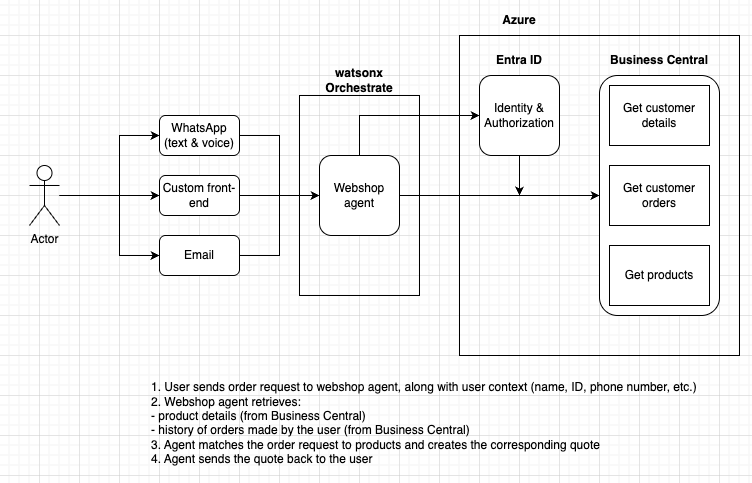

# Planted Sales Agent Documentation

## Architecture Diagram



**Current status:** The Business Central connection, agent, and all tools are implemented and functional. The next step is adding a secure customer-facing frontend with authentication (e.g. login portal, WhatsApp phone verification, or email identity).

---

## Table of Contents

1. [Shop Agent](#shop-agent)
   - [Architecture Overview](#architecture-overview)
   - [Tools](#shop-tools)
   - [Importing the Shop Tools and Agent](#importing-the-shop-tools-and-agent)
   - [Agent Capabilities](#agent-capabilities)
2. [Sales Agent (Legacy)](#sales-agent-legacy)
   - [Planted Sales Agent (Master Orchestrator)](#planted-sales-agent-master-orchestrator)
   - [Business Central Agent](#business-central-agent)
   - [Salesforce Agent](#salesforce-agent)
3. [Importing Agents and Tools](#importing-agents-and-tools)
   - [Connecting to the ADK](#connecting-to-the-adk)
   - [Setting Up the Business Central Connection](#setting-up-the-business-central-connection)
   - [Setting Up the Salesforce Connection](#setting-up-the-salesforce-connection)
   - [Importing Tools](#importing-tools)
   - [Importing Agents](#importing-agents)
4. [Channel Integrations](#channel-integrations)
   - [MS Teams Integration](#ms-teams-integration)
   - [WhatsApp Integration (via Twilio)](#whatsapp-integration-via-twilio)

---

## Shop Agent

The **Shop Agent** is a standalone agent for the direct-chat (store) channel. It handles the full order lifecycle — product browsing, order placement, modifications, cancellations, and reorders — via the watsonx Orchestrate webchat UI. It connects to Business Central using **team credentials** (OAuth2 Client Credentials) and creates orders as **sales quotes**.

### Architecture Overview

```
Customer (WXO Webchat)
    │
    ▼
watsonx Orchestrate — Shop Agent
    │
    ├── shop_identify_customer   ──► BC API (team creds)
    ├── shop_get_products        ──► BC API (team creds)
    ├── shop_get_orders          ──► BC API (team creds)
    ├── shop_create_order        ──► BC API (team creds)
    ├── shop_modify_order        ──► BC API (team creds)
    └── shop_cancel_order        ──► BC API (team creds)
    │
    ▼
Business Central — Sales Quotes
    │
    ▼ (manual review + "Make Order")
Business Central — Sales Orders
```

| Component | Details |
|---|---|
| Agent | `Shop_Agent` — standalone, no sub-agents |
| Connection | `business_central_wa` — OAuth2 Client Credentials, team type |
| Tools | 6 tools in `shop_agent/tools/business_central_shop/` |
| Channel | WXO webchat (direct chat) |
| LLM | `groq/openai/gpt-oss-120b` |

---

### Tools

The six tools are in `shop_agent/tools/business_central_shop/`:

| Tool | File | Description |
|---|---|---|
| `shop_identify_customer` | `shop_identify_customer.py` | Look up a customer by name or email. Returns customer_id, business name, last shipped order, and pending orders. Must be called first. |
| `shop_get_products` | `shop_get_products.py` | Get all Planted products with prices and stock status. Returns `in_stock` and `out_of_stock` lists. |
| `shop_get_orders` | `shop_get_orders.py` | Get recent order history for a customer — both shipped (non-editable) and pending (editable) orders. |
| `shop_create_order` | `shop_create_order.py` | Create a new order (sales quote) with up to 10 line items and an optional note. |
| `shop_modify_order` | `shop_modify_order.py` | Modify a pending order by reference number. Replaces ALL items — must include every item the order should have after changes. |
| `shop_cancel_order` | `shop_cancel_order.py` | Cancel a pending order (SQ####) by reference number. Shipped orders (SO) cannot be cancelled. |

All tools use `ConnectionType.OAUTH2_CLIENT_CREDS` and fetch credentials via `connections.oauth2_client_creds("business_central_wa")`.

---

### Importing the Shop Tools and Agent

```bash
# Import all shop tools
orchestrate tools import -k python -f shop_agent/tools/business_central_shop/shop_identify_customer.py -a business_central_wa
orchestrate tools import -k python -f shop_agent/tools/business_central_shop/shop_get_products.py -a business_central_wa
orchestrate tools import -k python -f shop_agent/tools/business_central_shop/shop_get_orders.py -a business_central_wa
orchestrate tools import -k python -f shop_agent/tools/business_central_shop/shop_create_order.py -a business_central_wa
orchestrate tools import -k python -f shop_agent/tools/business_central_shop/shop_modify_order.py -a business_central_wa
orchestrate tools import -k python -f shop_agent/tools/business_central_shop/shop_cancel_order.py -a business_central_wa

# Import the agent
orchestrate agents import -f shop_agent/agents/Shop_Agent.yaml
```

> **Important:** The `-a business_central_wa` flag binds each tool to the connection. Without this, the tool will import but fail at runtime when it tries to fetch credentials.

To verify:

```bash
orchestrate agents list -v
```

Confirm that `Shop_Agent` appears with six tools attached.

---

### Agent Capabilities

| Action | How |
|--------|-----|
| Identify customer | Customer provides company name or email. Agent calls `shop_identify_customer` and greets them with their business name, last shipped order, and pending orders. |
| Show products | Agent calls `shop_get_products`. Shows only in-stock items with name and unit price (CHF). |
| Show orders | Agent calls `shop_get_orders`. Shows pending (editable) and shipped orders separately with reference numbers. |
| Place order | Customer requests items and quantities. Agent calls `shop_get_products` for item IDs, then `shop_create_order`. No confirmation step — order is created immediately. |
| Modify order | Customer asks to change a pending order. Agent calls `shop_modify_order` with the COMPLETE new item list (replaces all items). |
| Cancel order | Customer asks to cancel a pending order (SQ####). Agent calls `shop_cancel_order`. Shipped orders cannot be cancelled. |
| Reorder last order | Agent uses the last shipped order from `shop_identify_customer`, checks stock via `shop_get_products`, and creates a new order with available items. |

---

## Sales Agent (Legacy)

The Planted sales assistant system is built as a **multi-agent architecture** — an orchestrator agent routes requests to two specialized sub-agents, each connected to a different backend system.

### Planted Sales Agent (Orchestrator)

The top-level agent that users interact with directly. It does not answer Business Central or Salesforce questions itself — instead, it delegates every request to the appropriate sub-agent based on what the user is asking. When a request spans both systems (e.g., a customer exists in Business Central *and* has open opportunities in Salesforce), it calls both sub-agents and merges the results into a single response.

---

### Business Central Agent

Connects to **Microsoft Dynamics 365 Business Central** and handles all sales order and inventory operations. Its core capabilities include:

- **Customer lookup** — Search customers by name or ID to resolve GUIDs before taking further action.
- **Inventory checks** — Retrieve available stock levels, item numbers, and units of measure.
- **Sales order creation** — Draft sales orders with up to 10 line items in a single request, with confirmation before submission.
- **Order history** — Pull all orders for a specific customer or within a given date range.
- **Order detail retrieval** — Fetch full order breakdowns including line items, unit prices, taxes, and totals.

---

### Salesforce Agent

Connects to **Salesforce CRM** and handles all pipeline, account, and opportunity operations. Its core capabilities include:

- **Account & contact lookup** — Search accounts by name to resolve Account IDs before creating or querying opportunities.
- **Opportunity management** — Find, create, and update opportunities filtered by date range, stage, or account.
- **Product & pricing lookup** — Retrieve active products and prices from the standard Salesforce price book.
- **Call logging** — Log completed calls against any opportunity with subject, notes, date, and duration.
- **Notes** — Add titled notes directly to any opportunity record.

---

## Importing Agents and Tools

> **Order matters.** Imports must follow this sequence or they will fail:
> 1. Connect to the ADK
> 2. Set up API connections (Business Central, Salesforce)
> 3. Import tools
> 4. Import sub-agents (Business Central Agent, Salesforce Agent)
> 5. Import the master orchestrator (Planted Sales Agent)
>
> Each layer depends on the one below it being in place first.

---

### Connecting to the ADK

Before importing any tools or agents, you need to install the watsonx Orchestrate ADK and connect it to your environment. Full ADK documentation is available at [developer.watson-orchestrate.ibm.com](https://developer.watson-orchestrate.ibm.com/getting_started/installing).

Install Python 3.11:

```bash
brew install python@3.11
```

Create and activate a virtual environment:

```bash
python3.11 -m venv .venv
source ./.venv/bin/activate
```

Install the watsonx Orchestrate ADK:

```bash
pip install ibm-watsonx-orchestrate
```

Add your environment and activate it — the service instance URL is the base URL of your watsonx Orchestrate instance:

```bash
orchestrate env add -n <environment-name> -u <service-instance-url>
orchestrate env activate <environment-name>
```

Once activated, all subsequent `orchestrate` CLI commands will run against this environment.

---

### Setting Up the Business Central Connection

This connection uses **OAuth2 Authorization Code** with **Member credentials**, so each user logs in with their own Microsoft account. Their access in Business Central is scoped to their own user permissions — no per-user configuration is needed in watsonx Orchestrate.

| | Client Credentials (shared) | Auth Code + Member (per-user) |
|---|---|---|
| Who authenticates? | A single shared service account | Each user logs in individually |
| User context | All API calls run as one app identity | Each user's own BC permissions apply |
| First tool call | Works immediately (team creds pre-set) | Prompts user to log in via Microsoft |
| Best for | Backend automation, no user involved | Interactive agents where user identity matters |

#### Prerequisites

- Each user who will use the Business Central tools must have a Microsoft account in your Azure AD tenant with a Business Central license
- Their Business Central user permissions determine what data they can access via the API
- No separate API keys, connections, or credentials are needed per user — the Azure app registration is the "door", each user brings their own "key" (their Microsoft login)

---

#### Part 1: Register an App in Microsoft Entra ID (Azure AD)

This gives watsonx Orchestrate a secure OAuth identity to authenticate against Business Central on behalf of each user.

1. Go to [portal.azure.com](https://portal.azure.com) and navigate to **App registrations**.

2. Open your existing app registration or click **New registration** to create one.

3. From the **Overview** page, note down the following:
   - **Application (client) ID**
   - **Directory (tenant) ID**

4. Go to **Certificates & secrets → Client secrets** and copy the **Value** of your active secret. If none exists, click **New client secret**, give it a description and expiry, then copy the value immediately — it is only shown once.

---

#### Part 2: Configure API Permissions (Delegated Only)

1. Go to **API permissions** and click **Add a permission**.
2. Select **Dynamics 365 Business Central** from the API list.
3. Choose **Delegated permissions** (not Application permissions).
4. Select **Financials.ReadWrite.All**.

   | API | Permission | Type | Admin Consent Required |
   |---|---|---|---|
   | Dynamics 365 Business Central | `Financials.ReadWrite.All` | Delegated | No |
   | Microsoft Graph | `User.Read` | Delegated | No |

---

#### Part 3: Configure Authentication (Redirect URIs)

1. Go to **Authentication (Preview)** in the left sidebar.
2. Under **Redirect URI configuration**, add the watsonx Orchestrate OAuth callback URL as a **Web** platform redirect URI:
   ```
   https://eu-central-1.dl.watson-orchestrate.ibm.com/mfe_connectors/api/v1/agentic/oauth/_callback
   ```
3. Confirm **Allow public client flows** is **Disabled**.
4. Click **Save**.

---

#### Part 4: Create the Connection in watsonx Orchestrate

Import the connection or create via the UI with these settings:

| Field | Value |
|---|---|
| **Server URL** | `https://api.businesscentral.dynamics.com/v2.0/{tenant-domain}/{environment}/api/v2.0` |
| **Token URL** | `https://login.microsoftonline.com/{tenant-id}/oauth2/v2.0/token` |
| **Authorization URL** | `https://login.microsoftonline.com/{tenant-id}/oauth2/v2.0/authorize` |
| **Client ID** | Application (client) ID from Azure app Overview |
| **Client Secret** | The secret value from Certificates & secrets |
| **Scope** | `https://api.businesscentral.dynamics.com/.default offline_access` |

---

### Setting Up the Salesforce Connection

This connection uses **OAuth2 Authorization Code** with **Member credentials**. Each user logs in with their own Salesforce account when they first use a Salesforce tool.

#### Part 1: Create a Connected App in Salesforce

1. In Salesforce Setup, go to **App Manager** → **New External Client App**.
2. Configure OAuth Settings:
   - **Callback URL** — your WXO OAuth callback URL
   - **OAuth Scopes** — `api`, `full`, `refresh_token, offline_access`
3. Enable **Authorization Code and Credentials Flow**.
4. Under Security, check **Require secret for Web Server Flow** and **Require secret for Refresh Token Flow**. Leave PKCE unchecked.

#### Part 2: Create the Connection in watsonx Orchestrate

| Field | Value |
|---|---|
| **Server URL** | Your Salesforce instance URL |
| **Token URL** | `{instance-url}/services/oauth2/token` |
| **Authorization URL** | `{instance-url}/services/oauth2/authorize` |
| **Client ID** | Consumer Key from the Connected App |
| **Client Secret** | Consumer Secret from the Connected App |
| **Scope** | `api refresh_token offline_access` |

---

### Importing Tools

With both connections in place, import the tools for each sub-agent. Tools must exist in the environment before the agents that use them can be imported.

```bash
# Business Central tools
orchestrate tools import -k python -f <path-to-bc-tool-file> -a business_central

# Salesforce tools
orchestrate tools import -k python -f <path-to-sf-tool-file> -a salesforce
```

To verify all tools have been registered:

```bash
orchestrate tools list
```

---

### Importing Agents

Once all tools are imported, import the agents in order:

```bash
# 1. Business Central Agent
orchestrate agents import -f business_central_agent.yaml

# 2. Salesforce Agent
orchestrate agents import -f salesforce_agent.yaml

# 3. Planted Sales Agent (orchestrator)
orchestrate agents import -f planted_sales_agent.yaml
```

## Channel Integrations

watsonx Orchestrate supports multiple messaging channels. Full ADK channel documentation is available at [developer.watson-orchestrate.ibm.com/channels/establishing_channels](https://developer.watson-orchestrate.ibm.com/channels/establishing_channels).

> **Critical limitation:** OAuth connections are **only supported in the watsonx Orchestrate integrated webchat UI**. They do not work on external channels such as MS Teams, WhatsApp, or embedded webchat. To use authenticated tools on external channels, use **Key-Value connections** and handle the token exchange manually in your Python tool code.

---

### MS Teams Integration

For instructions on setting up the Planted Sales Agent in Microsoft Teams, including channel configuration and bot permissions, see the setup guide:

[MS Teams Channel Setup Guide](documents/channel_setup_teams.pdf)

---

### WhatsApp Integration (via Twilio)

To connect an agent to WhatsApp via Twilio:

1. **Register a WhatsApp Sender** in the Twilio Console under Messaging → Senders → WhatsApp Senders.
2. **Create a channel config YAML** with your Twilio Account SID and Auth Token.
3. **Import the channel** via CLI:
   ```bash
   orchestrate channels import --agent-name <agent-name> --env draft --file channel.yaml
   ```
4. **Paste the Event URL** from the import output into the Twilio WhatsApp Sender's webhook configuration.
5. **Test** by sending a WhatsApp message to your registered number.

> **Note:** A single Twilio WhatsApp sender can only point to one webhook URL at a time.
